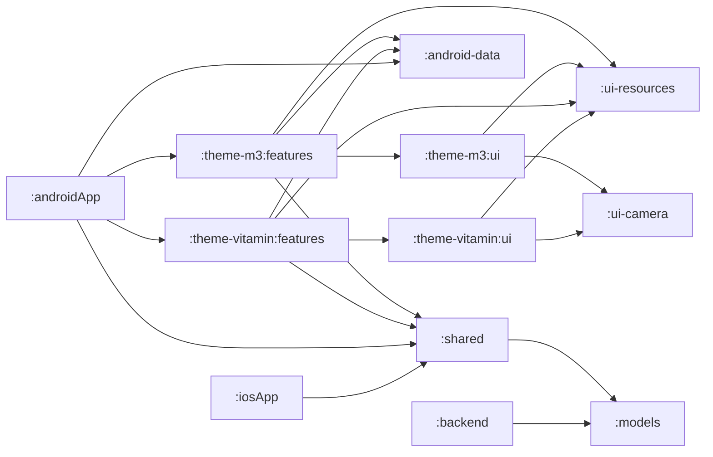

# Conferences4Hall

Real life Kotlin Multiplatform project with an iOS application
developed in Swift with SwiftUI, an Android application developed
in Kotlin with Jetpack Compose and a backed in Kotlin hosted on
AppEngine.

## Backend Features

* Create the agenda of your conference, optionally from [Conference Hall](https://github.com/bpetetot/conference-hall)
* Fetch your partners from [CMS4Partners](https://github.com/GDG-Lille/cms4partners)
* Create your feedback forms from [OpenFeedback.io](https://github.com/HugoGresse/open-feedback)
* Import a participant ticket from [BilletWeb](https://www.billetweb.fr/)
* Import partner jobs from [WeLoveDevs](https://welovedevs.com/)

## Mobile Features

* Select your conference
* Conference schedule
* Bookmarking of talks
* Speaker page with biography, socials and talks
* Networking space which privacy respect from mobile to mobile
* Partners with description, socials, jobs and location
* Event page with socials, location, menus, q&a and code of conduct
* Scan your event ticket
* Enjoy your conference!

## Build With

* [Kotlin](https://kotlinlang.org/) - First class and official programming language for Android development
* [Jetpack Compose](https://developer.android.com/jetpack/compose) - Modern toolkit for building native UI
* [Accompanist](https://github.com/google/accompanist) - Collection of extension libraries for Jetpack Compose
* [Coil](https://github.com/coil-kt/coil) - Media management and image loading framework for Android
* [ViewModel](https://developer.android.com/topic/libraries/architecture/viewmodel) - Stores UI-related data that isn't destroyed on UI changes
* [Navigation Compose](https://developer.android.com/jetpack/compose/navigation) - Allow users to navigate across, into, and back out from the different pieces of content within your app
* [Swift](https://www.swift.org/) - First class and official programming language for iOS development
* [SwiftUI](https://developer.apple.com/xcode/swiftui/) - Build apps across all Apple platforms with Swift 
* [Kotlin Coroutines](https://kotlinlang.org/docs/coroutines-guide.html) - Light-weight threads
* [kotlinx.serialization](https://github.com/Kotlin/kotlinx.serialization) - Kotlin Multiplatform / multi format serialization
* [SQLDelight](https://github.com/cashapp/sqldelight) - Generates typesafe Kotlin APIs from SQL
* [Okio](https://github.com/square/okio) - A modern I/O library for Android, Java, and Kotlin Multiplatform
* [Multiplatform Settings](https://github.com/russhwolf/multiplatform-settings) - Kotlin Multiplatform library for saving simple key-value data
* [ktor](https://github.com/ktorio/ktor) - Client to make HTTP request and HTTP server routing
* [Firestore](https://github.com/googleapis/java-firestore) - JVM client to make request on Firestore
* [Storage](https://github.com/googleapis/java-storage) - JVM client to make request on Storage

## Architecture

Kotlin Multiplatform project where `:androidApp` and `:iosApp` share the same
codebase for the business logic (with `:shared` module). `:backend` and `:shared` modules 
share the same models due to `:models` module and avoid any errors in the parsing of backend
responses.

3 design system are used in this project and can be found in `theme-{ds-name}`. All these
modules contains `features` and `ui` modules to bind Composable with their ViewModels and to 
create all components of the Design System.



## Testing

### Running in local

Start firebase emulators inside a terminal with Firestore service.

```bash
firebase login # If you are not yet logged
firebase emulators:start --project $RANDOM_FIREBASE_PROJECT_ID
```

Start appengine server inside another terminal to interact with the
local instance of your Firebase.

```bash
export GOOGLE_APPLICATION_CREDENTIALS=/path/to/key.json
export PROJECT_ID=$RANDOM_FIREBASE_PROJECT_ID
export BASE_URL_CONFERENCE_HALL=conference-hall.io
./gradlew :backend:installDist && ./backend/build/install/backend/bin/backend
```

Now, you can start to interact with the backend.

### Deploy in GCP

#### Prerequisites

* Billing account enabled on your GCP project
* Gcloud app created: `gcloud app create`
* Cloud Build service enabled
* Cloud Firestore service enabled
* Secret Manager enabled
* Geocoding enabled
* Add secret `GEOCODE_API_KEY` in Secret Manager with geocoding api key

#### Deploy in GCP with AppEngine

Be sure to edit the `app.yaml` file in `backend/src/main/appengine` folder with your project id 
before to deploy.

```bash
# If you are not yet logged
gcloud auth login
gcloud config set project $PROJECT_ID
# Deploy in production
./gradlew :backend:appengineDeploy
```

#### Deploy in GCP with Cloud Run

```bash
# If you are not yet logged
gcloud auth login
gcloud config set project $PROJECT_ID
# Deploy in production
gcloud builds submit --timeout 1h --tag gcr.io/$PROJECT_ID/$IMAGE:$TAG .
gcloud run deploy $IMAGE --image=eu.gcr.io/$PROJECT_ID/$IMAGE:$TAG \
  --platform managed \
  --port 8080 \
  --region europe-west1 \
  --set-env-vars=IS_CLOUD=true \
  --set-env-vars=BASE_URL_CONFERENCE_HALL=conference-hall.io \
  --set-env-vars=PROJECT_ID=$PROJECT_ID \
  --set-env-vars=GOOGLE_APPLICATION_CREDENTIALS=$GOOGLE_APPLICATION_CREDENTIALS
```

## References

* [SwiftUI vs Jetpack Compose by an Android Engineer](https://proandroiddev.com/swiftui-vs-jetpack-compose-by-an-android-engineer-6b48415f36b3)
* [Devfest Lille Android](https://play.google.com/store/apps/details?id=org.gdglille.devfest.android)
* [Devfest Lille iOS](https://apps.apple.com/fr/app/apple-store/id1624758676)
* [Tech Day 2022](https://play.google.com/store/apps/details?id=com.decathlon.tech.day.android)

## License

    Copyright 2022 Gérard Paligot.

    Licensed under the Apache License, Version 2.0 (the "License");
    you may not use this file except in compliance with the License.
    You may obtain a copy of the License at

       http://www.apache.org/licenses/LICENSE-2.0

    Unless required by applicable law or agreed to in writing, software
    distributed under the License is distributed on an "AS IS" BASIS,
    WITHOUT WARRANTIES OR CONDITIONS OF ANY KIND, either express or implied.
    See the License for the specific language governing permissions and
    limitations under the License.
